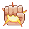

# Adventurer Factory
<em>No-one knew who had cast the spell that caused the ground to crumble and the oceans to swallow the land, but, as everyone said "Well, it certainly wasn't me!"

Mistrust reigned far wider than any King or Empress, and nobody was spared from the fever. Disputes and skirmishes and wars naturally spread across the realm, and even the basest of commoners would preface every greeting and goodbye with a sideways glance.

And so this is how it is when you, a mysterious traveller on a dusty road, chance to meet another.  Who are they?  What are they hiding? **Why are they looking at _you_ like that?**  Should you chase them off, bring them to reason, or simply leave them bleeding on the well trodden dirt?  Or will they get to you first?</em>

## Goal
Deplete opponents _Health_ (💗) or _Willpower_ () to 0 by building a powerful character and then using his or her best abilities.

## Summary
The basic idea is as you play, you fill out your hypothetical character sheet with Class and Race abilities, fill out inventory slots with equipment, and level up allowing you to play more effective abilities or equip more powerful equipment. At the same time, you will be using what abilities you have to either beat down an opponent or send them packing via a more diplomatic route.

Once you play a card that is associated with a given Class or Race, your character becomes that Class/Race. Play a second Class card to access 2nd level features, or play a different class to "Multiclass" or increase the level of a class you already have.

You also have Equipment slots to manage.  Certain cards may require that you have a free hand, or not be wearing any Armour.  When playing a card like this, you can discard what you already have in order to play the new card in that slot.  The system is extensible, you don't have a limited set of slots, but cards that share a given symbol cannot be played together.

To keep thing interesting and add on some table-top RPG flair, effects will often have you rolling dice, rather than eg. doing a flat amount of damage.

## Equipment

- 40 Card Deck per player.
- Set of D&D dice ie. d4, d6, d8, d10, d12, d20
- Some way to keep track of Experience (), Health (💗) and Willpower ()
### Optional
- Something to track your _Attack Die_ and _Parley Die_.
- Something to track _Attack_ (💪), _Defense_ (⛊) and _Charisma_ ()
      bonuses + any other card-specific resources.

## Setup
1. Each player starts with 20 💗 and 20 
2. Each Players starts with a Violence and Parley Die of 1d1 (that is, a flat 1 damage)
2. Player 1 takes 2 
3. Player 2 takes 4 
4. Each deck is shuffled and each player draws 5 cards.

## Phases each Turn
### Resource Step
1. Take 1 for each card you have in play, with a minimum of 1.
2. If you have more than 10, discard the surplus.
3. Draw 1 card if possible.

### Main step
As many times as you like / can afford, do the following.
- Play a card
    1. Check whether the card has any `Needs` listed.  The card cannot be played unless all `Needs` are met.
        - For example, your only card in play is `Knight` which provides `1xKnight`.  In your hand, you have `Silent Steps`, which needs 1x`Assasin`,`Silver Ring` which has no needs,  `Squire` which needs 1x`Knight` and  `Knightly Banner` which needs `2xKnight`.  You may play `Silver Ring` or `Squire`, but you may not play `Silent Steps` or `Knightly Banner`.        
    2. Check what inventory slot/s the card `Fills`, and check whether you already have a card in play that has filled the same slot.
    3. If so, and you still want to play the new card, Discard the existing card in that slot.
    4. Pay the new card's  cost.
    5. Place the card in front of you.
    6. Allow your opponent to respond with one of their actions.
    7. Respond in turn and so on....
    8. Finally, resolve any immediate effects of the new card.

- Perform an action.
    Actions are what is written on the cards you have in play, in the format **_Cost 1_ : Effect**
    If an action has no cost, it will simply start with a colon ':'
    1. Check that this action can be played - actions can only be played once per turn per card with that action.
    2. Pay the cost
    2. If the action was from a `Consumable` card, turn it on its side to indicate it has now been _Consumed_.
    3. Perform the action
    4. Allow your opponent to respond with an action and so on...
 
- Discard one of your in-play cards.
     There may be times when you find it advantageous to remove one of your cards from play.  You may do this on your turn unless a card says otherwise.
     1. Pay 1
     2. Put the card in the discard pile.

### Encounter Step
In the encounter step, you may do one of the following.
- Attack by rolling your _Attack Die_ in order to lower your opponents 💗 and defeat them in combat.
    - The formula is `New 💗 = Old 💗 - (Attack Die + Your 💪 - Their ⛊)`
    - This is called a Simple Attack
- Roll your _Parley Die_ to lower their Willpower, and give up the fight.
    - The formula is `New  = Old  - (Parley Die + Your  - Their )`
    - This is called a Simple Parley
- Perform the action on a card you have in play that includes a cost of _<ins>Encounter</ins>_:

NB: It is possible to have negative values for 💪, ⛊ or , but a Simple Attack or Simple Parley can never add more 💗/ rather than reduce it.

### Clean up Step
Each player discards any consumables that have been used.

## End Conditions
- When a player has 0 💗 or 0  at the end of a turn.
- When a player has 0 cards in their deck AND did not Play a card on their turn.
- When a player requests a draw at any time and it is accepted by their opponent.

## Card types
Each card has at least one _Type_ and can have any number beyond that, separated by `/`. 
- The only _Type_ with special rules attached is `Consumable`. After an action from a `Consumable` is used, the card is _Consumed_.  _Consumed_ cards are considered In Play until the following _Clean up Step_, at which point they are Discarded.
